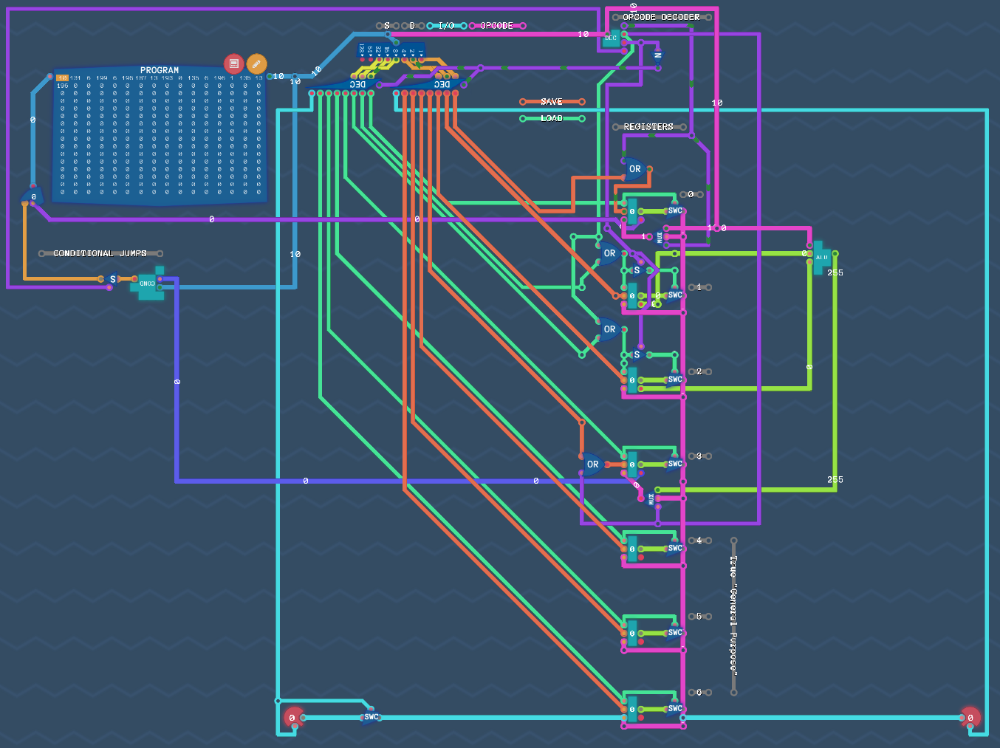

# Overture Assembly Manual (tcasm)

<div align="center">
  
</div>

## Registers
My version of the Overture computer has a total of 7 registers:
- `r0`:
    + Immediate values (non-instruction bytes from ROM) are saved to this register. 
- `r1`:
    + Used as the first operand in ALU operations.
- `r2`:
    + Used as the second operand in ALU operations.
- `r3`:
    + Stores the result of ALU operations.
    + Is also what is checked when doing conditional jumps (E.g. `JEZ`, `JGZ`, etc.)
- `r4`, `r5`, `r6`:
    + These three are all general purpose registers and are not used by the CPU itself in any particular operation.
    + These should be used for general purpose data in programs as to not accidentally interfere with ALU operations.

## Instructions

This manual details the instructions present in TCASM, which is an assembly language I have created which is converted into machine code that the Overture can actually understand. That is to say, that some (many) of the instructions in here are not present in the Overture design as built-in instructions. Many of the instructions here are made up of several "bare metal" instructions when the conversion from TCASM (Turing Complete Assembly) to TCU (Turing Complete Ugly), the native machine code, takes place. 

### mov
Usage: `mov <src>, <dst>`
- The source can be a register or immediate value
- The destination is a register
- Input and Output are treated as registers, like the example below:
`mov IN, OUT`
- There is no naming distinction between source and destination registers as there may be when writing native machine code. Example:
    + Native Machine code: `MOV | s0 | d4`
    + Is written as `mov r0, r4` in TCASM.
    + This is possible due to the boilerplate register definitions that the converter prefixes all TCU output programs with.

## const
Usage: `const <const_name> <const_value>`
`const` is a built-in feature in Turing Complete, which simply assigns shorthand names to values. They are not variables.

## label
Usage: `label <label_name>`
Labels work the same way in TCASM as they do in base TCU. They provide dynamic instruction numbers for jump instructions.

### Jumps
#### Unconditional
`jmp <label>` will unconditionally jump to the instruction following the specified label.
#### Conditional
Conditional jumps compare the value present in `r3`, deciding to jump or not based on that value:
- `jez <label>`: Jumps to the label if `r3` contains zero.
- `jgz <label>`: Jumps to the label if `r3` contains value greater than zero.
- `jlz <label>`: Jumps to the label if `r3` contains a value less than zero.
- `jnz <label>`: Jumps to the label if `r3` contains any non-zero value.
- `jlez <label>`: Jumps to the label if `r3` contains a value less than or equal to zero.
- `jgez <label>`: Jumps to the label if `r3` contains a value greater than or equal to zero.


### Arithmetic and Logic: add, sub, or, nand, nor, and
Usage: `<op> <operand1> <operand2>`
These arithmetic and logical operations automatically copy the supplied operands (registers or immediate values) to registers `r1` and `r2` and then keeps the result in `r3`.

### call
Usage: `call <label>`
- Calls are similar to jumps, the difference is that when an particular instruction is jumped to via a `call`, it is expected to have a `return` after some following instructions. The TCASM converter automatically creates return labels, which allows subroutines to 'return' to the instruction after the intital call instruction.
- This is meant to imitate subroutine behaviour present in most real assembly languages. It isn't a perfect solution as the Overture CPU doesn't natively support it, so it adds additional instructions to the TCU code.

TCASM example:
```
jmp forever_main_loop

label some_subroutine
mov 4, OUT
return

label forever_main_loop

call some_subroutine
mov 2, OUT

jmp forever_main_loop
```
This example outputs 4, then 2, forever.
Here is that example in TCU, minus the boilerplate:
```
forever_main_loop
JMP
label some_subroutine
4
MOV | s0 | OUT
some_subroutine_RETURN
JMP
label forever_main_loop
some_subroutine
JMP
label some_subroutine_RETURN
2
MOV | s0 | OUT
forever_main_loop
JMP
```